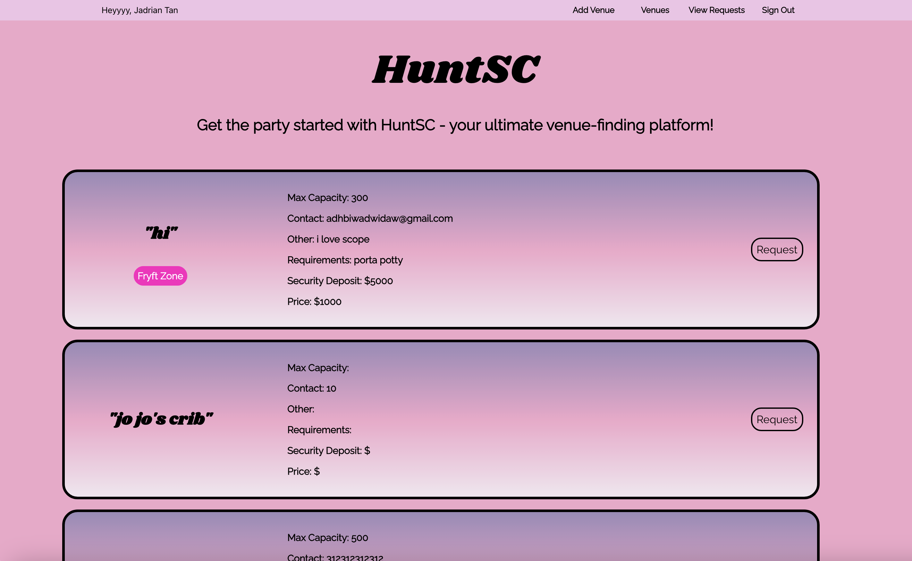
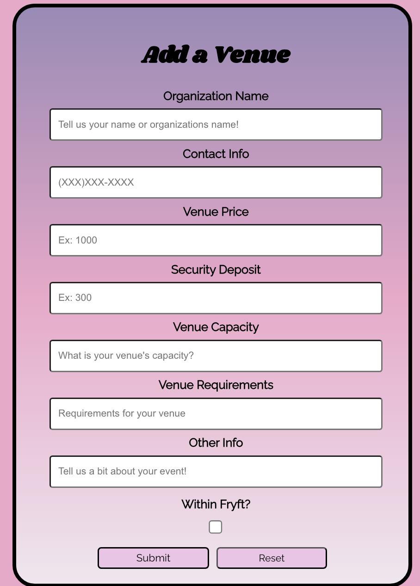

# HuntSC: Venue Hunt Application

HuntSC is a dedicated platform for users to discover and add venues for various events. Our platform is equipped with a user-friendly interface and seamless integration with Google for authentication using Firebase.

## Technologies Used
* Front-end: `React.js`, `Tailwind.css`
* Database: `Firebase`
* Authentication: `Firebase with Google OAuth`

## Features
1. **Search for Venues**: Users can search for the desired venue by providing necessary filters.
2. **Add a Venue**: Our platform allows users or organizations to add their venues by providing detailed information.
3. **Google Authentication**: Secure sign-in with Google credentials using Firebase.

### Google Authentication with Firebase

### Search for Venues

### Add a Venue

## Future Enhancements
* Integration with other sign-in methods like Facebook, Apple, etc.
* User reviews and ratings for venues.
* In-app communication for venue booking inquirie

